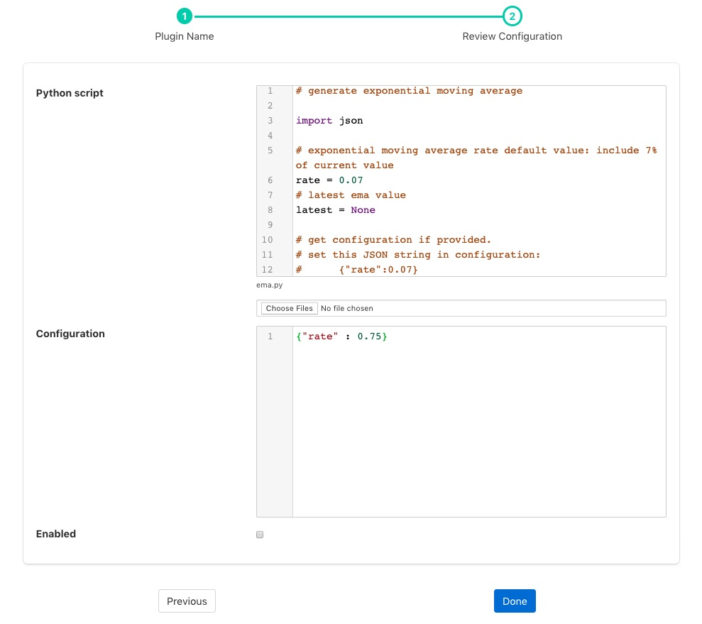
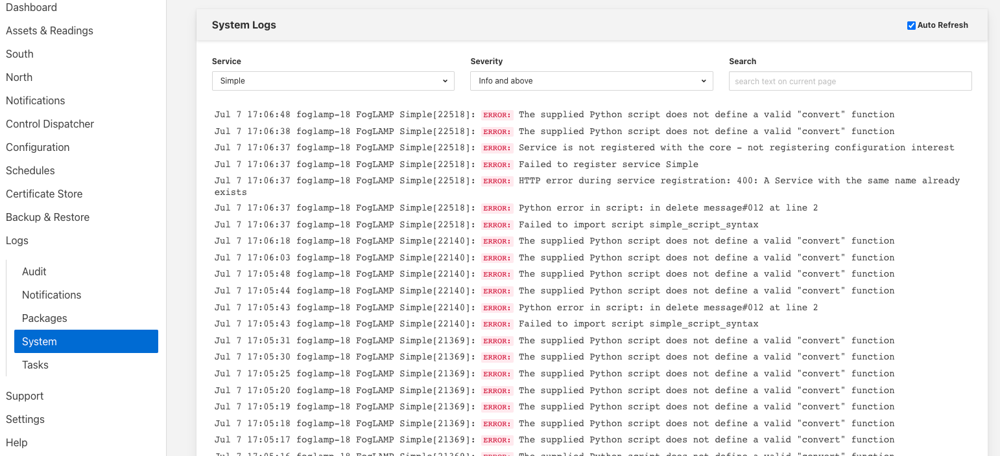
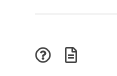

.. Images

.. Links
.. |python27| raw:: html

   <a href="../fledge-filter-python27/index.html">fledge-filter-python27</a>

Python 3.5 Filter
=================

The *fledge-filter-python35* filter allows snippets of Python to be easily written that can be used as filters in Fledge. A similar filter exists that uses Python 2.7 syntax, the |python27| filter, however it is recommended that the *python35* filter is used by preference as it provides a more compatible interface to the rest of the Fledge components. 

The purpose of the filter is to allow the user the flexibility to add their own processing into a pipeline that is not supported by any of the existing filters offered by Fledge. The philosophy of Fledge is to provide processing by adding a set of filters that act as a pipeline between a data source and and data sink. The data source may be the south plugin in the south service or the buffered readings data from the storage service in the case of a north service or task. The data sink is either the buffer within the storage service in the case of a south service or the north plugin that sends the data to the upstream system in the case of a north service or task. Each of the filters provides a small, focused operation on the data as it traverses the pipeline, data is passed from one filter in the pipeline to another.

The functionality provided by this filters gives the user the opportunity to write Python code that can manipulate the reading data as it flows, however that modification should follow the same guidelines and principles as followed in the filters that come supplied as part of the Fledge distribution or are contributed by other Fledge users. The overriding principles however are

  - Do not duplicate existing functionality provided by existing filters.

  - Keep the operations small and focused. It is better to have multiple filters each with a specific purpose than to create large, complex Python scripts.

  - Do not buffer large quantities of data, this will effect the footprint of the service and also slow the data pipeline. 

The Python code snippet that the user provides within this filter will be called with sets of asset readings as they or read or processed in a filter pipeline. The data appears in the Python code as a JSON document passed as a Python Dict type.

The user should provide a Python function whose name matches the name given to the plugin when added to the filter pipeline of the south service or north task, e.g. if you name your filter myPython then you should have a function named myPython in the code you enter. This function is passed a set of readings to process and should return a set of processed readings. The returned set of readings may be empty if the filter removes all data.

A general code syntax for the function that should be provided is as follows;

.. code-block:: python

   def myPython(readings):
       for elem in list(readings):
           ...
       return readings

The script iterates over the set of readings it is passed from the previous filter or the south plugin and returns the result of processing that data. Multiple readings are passed for two reasons, one is to improve the efficiency of processing and the second is because a south service or filter may ingest or process multiple readings in a single operation.

Each element that is processed has a number of attributes that may be accessed

.. list-table::
    :widths: 20 50
    :header-rows: 1

    * - Attribute
      - Description
    * - asset_code
      - The name of the asset the reading data relates to.
    * - timestamp
      - The data and time Fledge first read this data
    * - user_timestamp
      - The data and time the data for the data itself, this may differ from the timestamp above
    * - readings
      - The set of readings for the asset, this is itself an object that contains a number of key/value pairs that are the data points for this reading.

In order to access an data point within the readings, for example one named *temperature*, it is a simple case of extracting the value of with *temperature* as its key.

.. code-block:: python

   def myPython(readings):
       for elem in list(readings):
           reading = elem['readings']
           temp = reading['temperature']
           ...
       return readings

It is possible to write your Python code such that it does not know the data point names in advance, in which case you are able to iterate over the names as follows;

.. code-block:: python

   def myPython(readings):
       for elem in list(readings):
           reading = elem['readings']
           for attribute in reading:
               value = reading[attribute]
               ...
       return readings

The Python script is not limited to returning the same number of readings it receives, additional readings may be added into the pipeline or readings may be removed. If the filter removes all the readings it was sent it must still return either an empty list or it may return the *None* object.
    
A second function may be provided by the Python plugin code to accept configuration from the plugin that can be used to modify the behavior of the Python code without the need to change the code. The configuration is a JSON document which is again passed as a Python Dict to the set_filter_config function in the user provided Python code. This function should be of the form

.. code-block:: python

  def set_filter_config(configuration):
      config = json.loads(configuration['config'])
      value = config['key']
      ...
      return True

This function is called each time the configuration of the filter
is changed. The function is responsible for taking whatever actions
are required to change the behavior of the Python script. The most
common approach taken with the configuration function is to record
the configuration information in global variables for reference by the
Python script. This however is contrary to the recommendations for writing
Python scripts that are embedded within plugins.

There is little choice but to use globals in this case, however
precautions should be taken than minimize the risk of sharing common
global variables between instances.

  - Do not use common names or names that are not descriptive. E.g. avoid simply calling the variable *config*.

  - Do not use multiple variables, there are other options that can be used.

    - Use a single Python DICT as reference individuals items within the DICT

    - Create a Python class and use a global instance of the class

Adding Python35 Filters
-----------------------

Python35 filters are added in the same way as any other filters.

  - Click on the Applications add icon for your service or task.

  - Select the *python35* plugin from the list of available plugins.

  - Name your python35 filter, this should be the same name as the Python function you will provide.

  - Click *Next* and you will be presented with the following configuration page

    +--------------+
    | |python35_1| |
    +--------------+

  - Enter the configuration for your python35 filter

    - **Python script**: This is the script that will be executed. Initially you are unable to type in this area and must load your initial script from a file using the *Choose Files* button below the text area. Once a file has been chosen and loaded you are able to update the Python code in this page.

      .. note::

         Any changes made to the script in this screen will **not** be written back to the original file it was loaded from.

    - **Configuration**: You may enter a JSON document here that will be passed to the *set_filter_config* function of your Python code.

  - Enable the python35 filter and click on *Done* to activate your plugin

Example
-------

The following example uses Python to create an exponential moving average plugin. It adds a data point called *ema* to every asset. It assumes a single data point exists within the asset, but it does not assume the name of that data point. A rate can be set for the EMA using the configuration of the plugin.

.. code-block:: python

  # generate exponential moving average

  import json

  # exponential moving average rate default value: include 7% of current value
  rate = 0.07
  # latest ema value
  latest = None

  # get configuration if provided.
  # set this JSON string in configuration:
  #      {"rate":0.07}
  def set_filter_config(configuration):
      global rate
      config = json.loads(configuration['config'])
      if ('rate' in config):
          rate = config['rate']
      return True

  # Process a reading
  def doit(reading):
      global rate, latest

      for attribute in list(reading):
          if not latest:
              latest = reading[attribute]
          else:
              latest = reading[attribute] * rate + latest * (1 - rate)
          reading[b'ema'] = latest

  # process one or more readings
  def ema(readings):
      for elem in list(readings):
          doit(elem['reading'])
      return readings

Examining the content of the Python, a few things to note are;
      
  - The filter is given the name ``ema``. This name defines the default method which will be executed, namely ema().

  - The function ``ema`` is passed 1 or more readings to process. It splits these into individual readings, and calls the function ``doit`` to perform the actual work.

  - The function ``doit`` walks through each attribute in that reading, updates a global variable ``latest`` with the latest value of the ema. It then adds an *ema* attribute to the reading.

  - The function ``ema`` returns the modified readings list which then is passed to the next filter in the pipeline.

  - set_filter_config() is called whenever the user changes the JSON configuration in the plugin. This function will alter the global variable ``rate`` that is used within the function ``doit``.

Scripting Guidelines
--------------------

The user has the full range of Python functionality available to them within the script code they provide to this filter, however caution should be exercised as it is possible to adversely impact the functionality and performance of the Fledge system by misusing Python features to the detriment of Fledge's own features.

The overriding guidance given above should always be observed

  - Do not duplicate existing functionality provided by existing filters.

  - Keep the operations small and focused. It is better to have multiple filters each with a specific purpose than to create large, complex Python scripts.

  - Do not buffer large quantities of data, this will effect the footprint of the service and also slow the data pipeline.

Importing Python Packages
~~~~~~~~~~~~~~~~~~~~~~~~~

The user is free to import whatever packages they wish in a Python script, this includes the likes of the numpy packages and other that are limited to a single instance within a Python interpreter.

Do not import packages that you do not use or are not required. This adds an extra overhead to the filter and can impact the performance of Fledge. Only import packages you actually need.

Python does not provide a mechanism to remove a package that has previously been imported, therefore if you import a package in your script and then update your script to no longer import the package, the package will still be in memory from the previous import. This is because we reload updated scripts without closing down as restarting the Python interpreter. This is part of the sharing of the interpreter that is needed in order to allow packages such as numpy and scipy to be used. This can lead to misleading behavior as when the service gets restarted the package will not be loaded and the script may break because it makes use of the package still.

If you remove a package import form your script and you want to be completely satisfied that the script will still run without it, then you must restart the service in which you are using the plugin. This can be done by disabling and then re-enabling the service.

Use of Global Variables
~~~~~~~~~~~~~~~~~~~~~~~

You may use global variables within your script and these globals will retain their value between invocations of the of processing function. You may use global variables as a method to keep information between executions and perform such operations as trend analysis based on data seen in previous calls to the filter function.

All Python code within a single service shares the same Python interpreter and hence they also share the same set of global variables. This means you must be careful as to how you name global variables and also if you need to have multiple instances of the same filter in a single pipeline you must be aware that the global variables will be shared between them. If your filter uses global variables it is normally not recommended to have multiple instances of them in the same pipeline.

It is tempting to use this sharing of global variables as a method to share information between filters, this is not recommended as should not be used. There are several reasons for this

  - It provides data coupling between filters, each filter should be independent of each other filter.

  - One of the filters sharing global variables may be disabled by the user with unexpected consequences.

  - Filter order may be changed, resulting in data that is expected by a later filter in the chain not being available.

  - Intervening filters may add or remove readings resulting in the data in the global variables not referring to the same reading, or set of readings that it was intended to reference.

If you no wish one filter to pass data onto a later filter in the pipeline this is best done by adding data to the reading, as an extra data point. This data point can then be removed by the later filter. An example of this is the way Fledge adds OMF hints to readings that are processed and removed by the OMF north plugin.

For example let us assume we have calculated some value *delta* that we wish to pass to a later filter, we can add this as a data point to our reading which we will call *_hintDelta*.

.. code-block:: python

    
   def myPython(readings):
       for elem in list(readings):
           reading = elem['readings']
           ...
           reading['_hintDelta'] = delta
           ...
       return readings

This is far better than using a global as it is attached to the reading to which it refers and will remain attached to that reading until it is removed. It also means that it is independent of the number of readings that are processed per call, and resilient to readings being added or removed from the stream.

The name chosen for this data point in the example above has no significance, however it is good practice to choose a name that is unlikely to occur in the data normally and portrays the usage or meaning of the data.

File IO Operations
~~~~~~~~~~~~~~~~~~

It is possible to make use of file operations within a Python35 filter function, however it is not recommended for production use for the following reasons; 

  - Pipelines may be moved to other hosts where files may not be accessible.
    
  - Permissions may change dependent upon how Fledge systems are deployed in the various different scenarios.
   
  -  Edge devices may also not have large, high performance storage available, resulting in performance issues for Fledge or failure due to lack of space. 

  - Fledge is designed to be managed solely via the Fledge API and applications that use the API. There is no facility within that API to manage arbitrary files within the filesystem.

It is common to make use of files during development of a script to write information to in order to aid development and debugging, however this should be removed, along with associated imports of packages required to perform the file IO, when a filter is put into production.

Threads within Python
~~~~~~~~~~~~~~~~~~~~~

It is tempting to use threads within Python to perform background activity or to allow processing of data sets in parallel, however there is an issue with threading in Python, the Python Global Interpreter Lock or GIL. The GIL prevents two Python statements from being executed within the same interpreter by two threads simultaneously. Because we use a single interpreter for all Python code running in each service within Fledge, if a Python thread is created that performs CPU intensive work within it, we block all other Python code from running within that Fledge service.

We therefore avoid using Python threads within Fledge as a means to run CPU intensive tasks, only using Python threads to perform IO intensive tasks, using the asyncio mechanism of Python 3.5.3 or later. In older versions of Fledge we used multiple interpreters, one per filter, in order to workaround this issue, however that had the side effect that a number of popular Python packages, such as *numpy*, *pandas* and *scipy*, could not be used as they can not support multiple interpreters within the same address space. It was decided that the need to use these packages was greater than the need to support multiple interpreters and hence we have a single interpreter per service in order to allow the use of these packages.

Interaction with External Systems
~~~~~~~~~~~~~~~~~~~~~~~~~~~~~~~~~

Interaction with external systems, using network connections or any form of blocking communication should be avoided in a filter. Any blocking operation will cause data to be blocked in the pipeline and risks either large queues of data accumulating in the case of asynchronous south plugins or data begin missed in the case of polled plugins.

Scripting Errors
~~~~~~~~~~~~~~~~

If an error occurs in the plugin or Python script, including script coding errors and Python exception,  details will be logged to the error log and data will not flow through the pipeline to the next filter or into the storage service.

Warnings raised will also be logged to the error log but will not cause data to cease flowing through the pipeline.

To view the error log you may examine the file directly on your host machine, for example */var/log/syslog* on a Ubuntu host, however it is also possible to view the error logs specific to Fledge from the Fledge user interface. Select the *System* option under *Logs* in the left hand menu pane. You may then filter the logs for a specific service to see only those logs that refer to the service which uses the filter you are interested in.

+-------------+
| |logview_1| |
+-------------+

Alternatively if you open the dialog for the service in the *South* or *North* menu items you will see two icons displayed in the bottom left corner of the dialog that lets you alter the configuration of the service.

+-------------+
| |logview_2| |
+-------------+

The left most icon, with the *?* in a circle, allows you to view the documentation for the plugin, the right most icon, which looks like a page of text with a corner folded over, will open the log view page filtered to view the service.

Error Messages & Warnings
#########################

The following are some errors you may see within the log with some description of the cause and remedy for the error.

Unable to obtain a reference to the asset tracker. Changes will not be tracked
    The service is unable to obtain the required reference to the asset tracker within Fledge. Data will continue to flow through the pipeline, but there will not be ant trace of the assets that have been modified by this plugin within the pipeline.

The return type of the python35 filter function should be a list of readings.
    The python script has returned an incorrect data type. The return value of the script should be a list of readings

Badly formed reading in list returned by the Python script
    One or more of the readings in the list returned by the Python script is an incorrectly formed reading object.

Each element returned by the script must be a Python DICT
    The list returned by the Python script contains an element that is not a DICT and therefore can not be a valid reading.

Badly formed reading in list returned by the Python script: Reading has no asset code element
    One or more of the readings that is returned in the list from the script is missing the *asset_code* key. This item is the name of the asset to which the reading refers.

Badly formed reading in list returned by the Python script: Reading is missing the reading element which should contain the data
    One or more of the readings that is returned in the list from the script is missing the *reading* DICT that contains the actual data.

Badly formed reading in list returned by the Python script: The reading element in the python Reading is of an incorrect type, it should be a Python DICT
    One or more of the readings that is returned in the list from the script has an item with a key of *reading* which is not a Python Dict. This item should always be a DICT and contains the data values as key/value pairs.

Badly formed reading in list returned by the Python script:  Unable to parse the asset code value. Asset codes should be a string.
    One or more of the readings that is returned in the list from the script has an item with a key of *asset_code* whose value is not a string.

